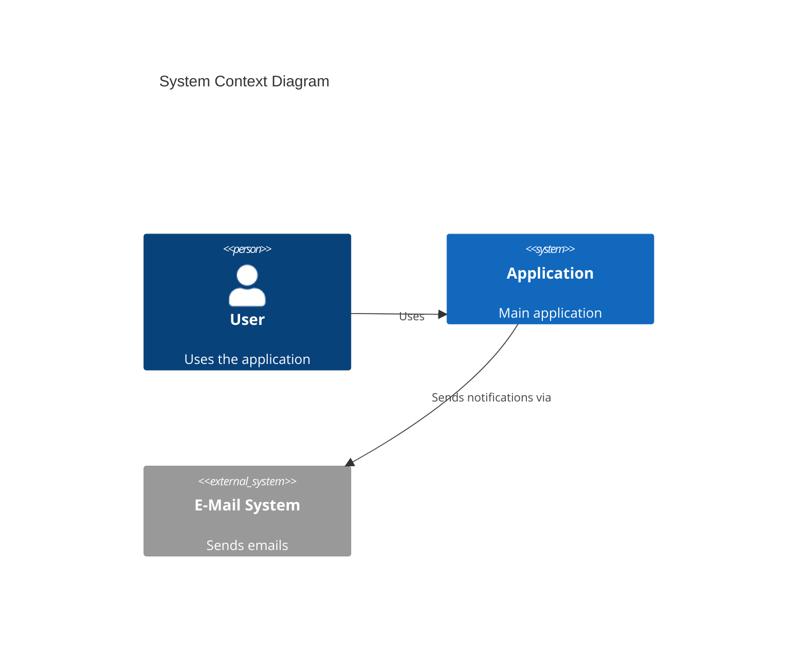
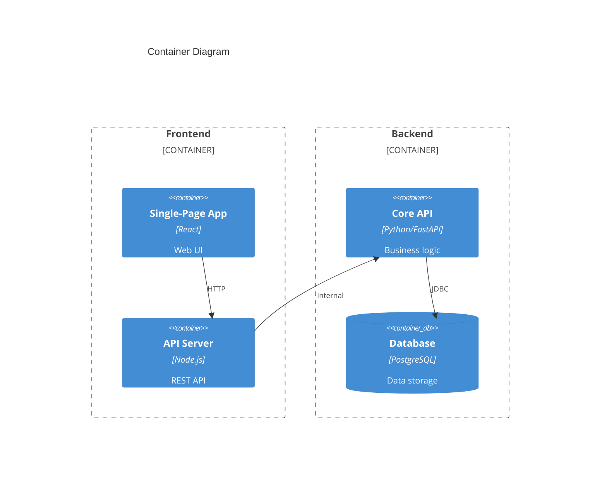
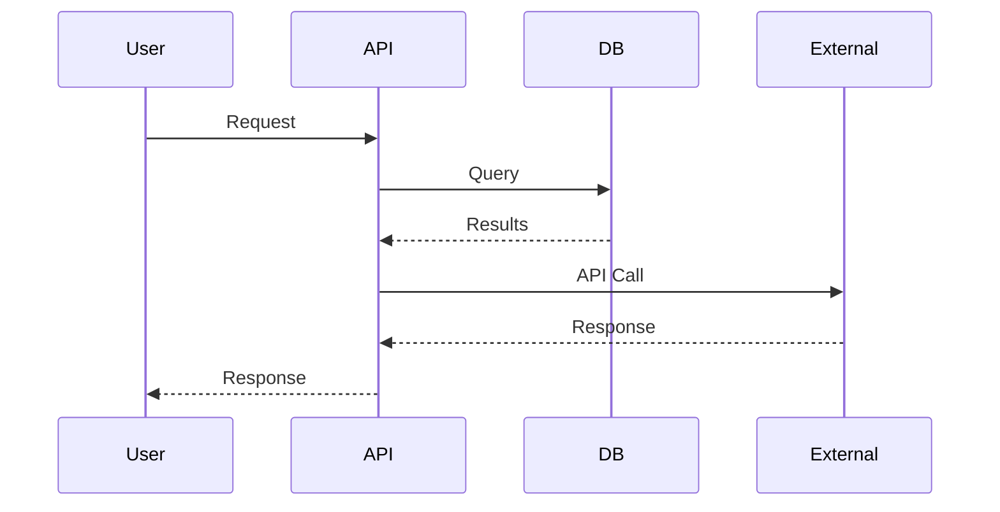
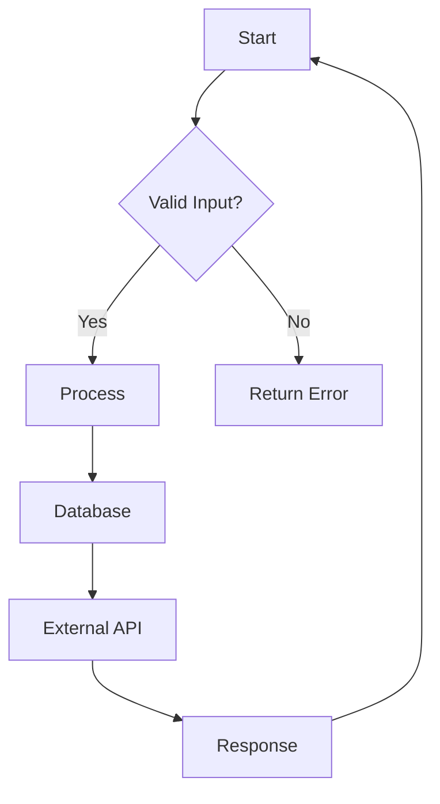

# Architecture Diagrams Guide

> This guide explains how to create and maintain architecture diagrams using Mermaid.
> All diagrams should be stored in this directory and version controlled.

## Why Mermaid?

- ✅ **Git-native**: Stored as code in Markdown
- ✅ **Version controlled**: Reviewed in PRs like code
- ✅ **Multiple renderers**: GitHub, VS Code, docs tools
- ✅ **Easy to update**: Edit directly in Markdown

## Diagram Types

### 1. System Context (C4Context)
Shows the big picture of the system.



### 2. Container Diagram (C4Container)
High-level architecture and technology choices.



### 3. Sequence Diagram
Runtime behavior and data flow.



### 4. Flowchart
Process flows and decision logic.



## File Naming Convention

```
docs/architecture/
├── README.md                    # This file
├── system-context.md            # System overview diagrams
├── containers.md                # Container/component diagrams
├── sequences/                   # Sequence diagrams
│   ├── user-authentication.md
│   └── payment-flow.md
└── data-flows/
    └── api-architecture.md
```

## Mermaid Support

| Platform | Support |
|----------|----------|
| GitHub | ✅ Native in Markdown |
| VS Code | ✅ Mermaid extension |
| Notion | ✅ Native |
| Obsidian | ✅ Native |
| Documentation sites | ✅ Various plugins |

## Links from ADRs

Each ADR should link to relevant diagrams:

```markdown
## Related Documents
- Architecture: [System Context](system-context.md)
- Data Flow: [API Architecture](data-flows/api-architecture.md)
```

## CI/CD Validation

Add this to check diagrams in PRs:

```yaml
# .github/workflows/docs.yml
- name: Validate Mermaid syntax
  run: |
    # Check for common Mermaid errors
    grep -r "C4Container\|sequenceDiagram\|flowchart" docs/
```

## Tips

1. **Keep diagrams current** - Update when architecture changes
2. **One diagram per concept** - Don't overload
3. **Use consistent styling** - Same colors for similar elements
4. **Document in ADRs** - Link diagrams to decision records
5. **Version control** - Diagrams are code - review in PRs